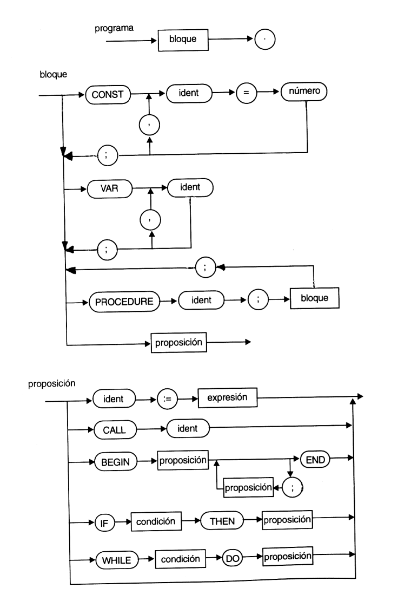
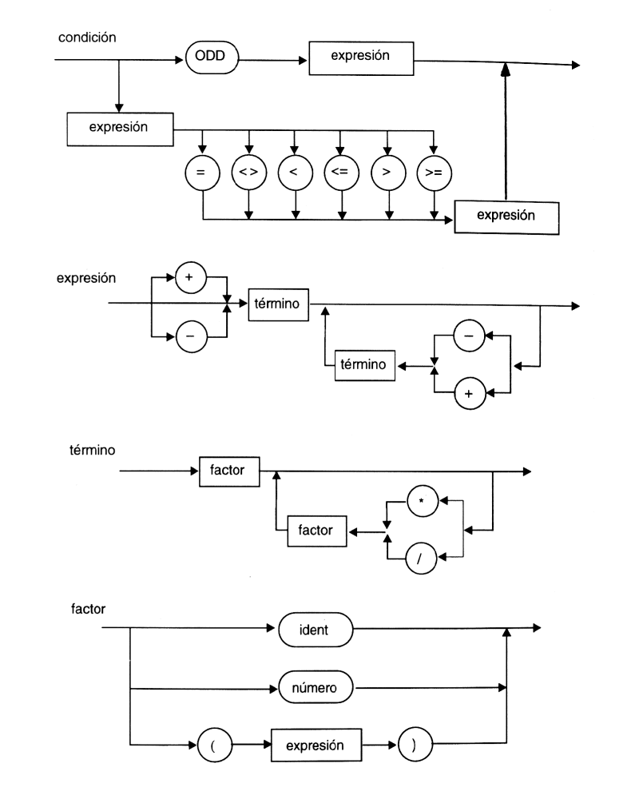

# Compilador PL/0 para Win32

Compilador construido para la materia Sistemas de Computación 1, del Instituto Nacional Superior del Profesorado Técnico - Universidad Tecnológica Nacional.  
Fue desarrollado utilizando C++, pensado para compilar archivos .pl0 para Win32. Se adjuntan los .dll para poder compilarlo y/o ejecutarlo, en mi caso fue con Codeblocks. Los fundamentos teóricos junto a las consignas se encuentran en el PDF. Los grafos para poder armarlo fueron los siguientes:

Fueron agregadas varias proposiciones adicionales: 
- _read_, _readln_ y _writeln_ para E/S por consola, 
- _halt_ y _succ_ en instancias de examen.

## Pendientes
- Reemplazar la matriz de _chars_ (_strings_ de C) en la función error por un enum, para mayor claridad.
- Terminar de implementar y/o corregir modificaciones al grafo original, como la proposición "FOR".